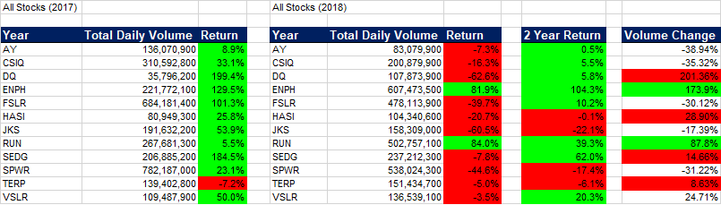
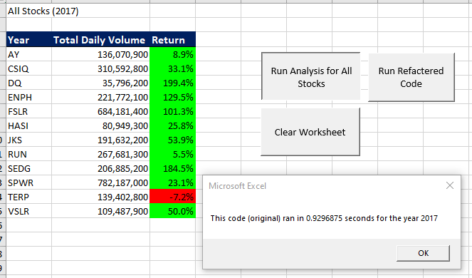
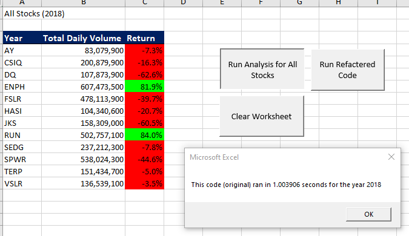
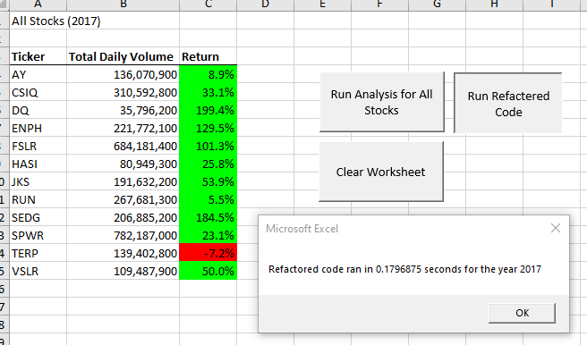
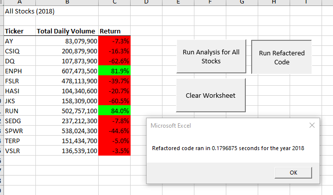

# Stock Analysis

## Overview of the Project

The purpose of this project is to help the Client (Steve) analyze two years of green technology stock returns for his parents.  Specifically, the analysis incorporates price and volume data in an effort to identify an attractive stock or portfolio of stocks.

## Results

### Stock Performance

[Exhibit 1: 2 Year Returns](other_resources/2_Year_Returns.png?raw=true "2 Year Returns")
Exhibit 1 ties the individual years returns and volume data together.  A cursory glance indicates that 2017 was a good year for stocks, with only one stock exhibiting a negative price return.  2018 was the opposite, with all but two stock negative on the year.  Combined, the 2 years was predicably mixed, with 8 stocks up and 4 down.

Importantly, the two stocks that were up in 2018 (ENPH and RUN) were up on significantly increased volume.  Steve’s parent’s philosophy that volume is an indicator of price discovery implies that these two issues are poised for continued success.  Of course, this analysis is much too shallow and true fundamental analysis should be conducted to make a proper determination, but on the technical aspects, these two stocks should be further examined.

### Code Performance (Original vs. Refactored)

[Exhibit 2: 2017 Run prior to refactorization](other_resources/01.2017Old.png?raw=true "2017 Run the Original Way")

[Exhibit 3: 2018 Run prior to refactorization](other_resources/02.2018Old.png?raw=true "2018 Run the Original Way")

[Exhibit 4: 2017 Run refactored](resources/VBA_Challenge_2017.png?raw=true "2017 Refactored")

[Exhibit 5: 2018 Run refactored](resources/VBA_Challenge_2018.png?raw=true "2018 Refactored")

Exhibits 2 through 5 show the code run times of the two years under analysis both before refactorization and after.  The refactored code is roughly 4x faster than the original script (.2 seconds vs .8 seconds).  

The original code looped through each line of the given year’s data for each ticker under investigation.  The refactored code loops visits each data row only once, evaluating which ticker is assigned to a given data row as part of the cycle.  Since this analysis uses 12 stocks, the result is a 12x reduction in loop count.  Further analysis would be required to quantify the amount of the reduction, but it is true to say that the efficiency gains are compounded as the number of tickers analyzed increases.

## Summary

### Advantages and Disadvantages of refactoring code

Refactoring code can be advantageous when the gains it generates outweigh the costs of implementing.  Gains can come in the form of increased system efficiency, or reduced monetary costs.  More, the presentation of the “clean sheet” offers the opportunity to simplify the code, making it more readable and possibly easier to maintain.  On the other hand, costs of refactoring can include the time demands on those conducting the refactoring, and the increased risk of error.  Whenever a complex system is modified in any significant way, the risk of error increases dramatically.

### Applicability to this project

[Exhibit 6: 2018 Run refactored](resources/Program_Run_Times.png?raw=true "Program Run Times")

Exhibit 6 shows the consistency of the run times: the refactored code is consistently faster.  The number of “trips” through the data is reduced by a factor of the number of tickers under analysis.  This doesn’t appear to translate linearly to a reduction in processing time, but there can be no doubt that efficiency gains are realized.  Now that the refactorization is done, there are no downsides, as all time invested is a sunk cost.  Since the code executes in 20% of the time, the refactored code is clearly superior.

